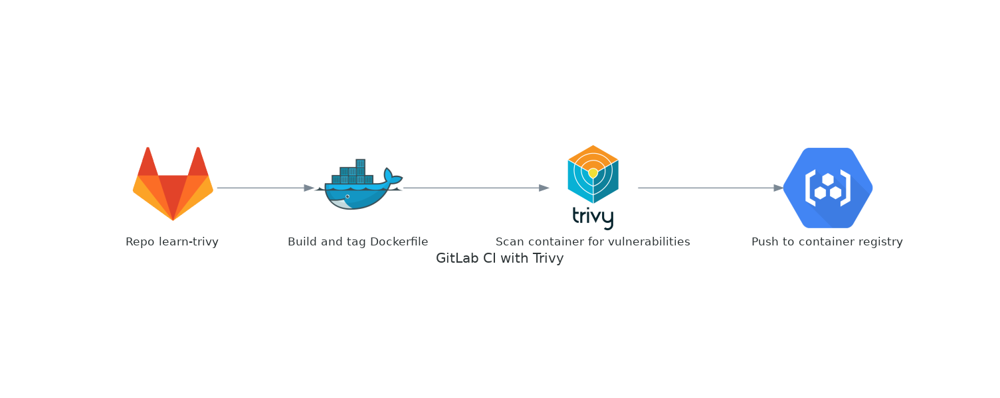
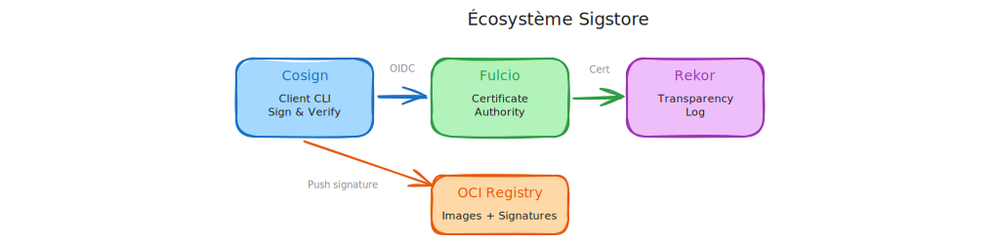
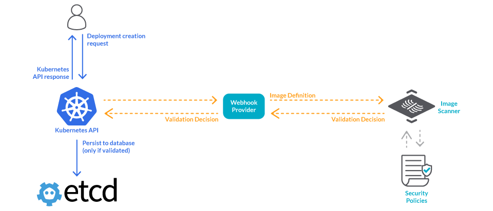

# Certified Kubernetes Security Specialist (CKS)


---

## Cluster setup

---

## CIS Benchmarks & K8s Hardening

- **Standardization**: Industry-wide best practices for secure K8s configuration.
- **Scope**: Covers API Server, ETCD, Kubelet, and Controller Manager.
- **Scoring**: Provides a clear "Pass/Fail" security posture.
- **CKS Focus**: Understanding which flags (e.g., `--anonymous-auth=false`) satisfy the benchmark.


---

## Kube-bench & Automation

- **Tooling**: Aqua Security's open-source tool to run CIS checks.
- **Remediation**: Output includes specific commands to fix vulnerabilities.
- **Continuous Compliance**: Monitoring drift in node security settings.


---

## LAB: Cluster Setup & Hardening

- **Exercise 1**: [Running Kube-bench as a Job](https://k8s-school.fr/labs/en/1_labs/kubebench-10-jobs/index.html   )
- **Exercise 2**: [Manual Remediation of Control Plane](https://k8s-school.fr/labs/en/1_labs/kubebench-20-remediations/index.html)
- **Exercise 3**: [Automation and Continuous Compliance](https://k8s-school.fr/labs/en/1_labs/kubebench-30-automation/index.html)

---

## Auditing, Monitoring, Logging

---

## API Server Audit Logging

- **Configuration**: Set via `--audit-policy-file` and `--audit-log-path` in `api-server` Pod.
- **⚠️ Exam Tip**: You MUST know how to mount the policy file and log directory using `hostPath` volumes and `volumeMounts` within the API Server static pod manifest.

---

## API Server Audit Workflow


---

### Simple Audit Policy Example

```yaml
apiVersion: audit.k8s.io/v1
kind: Policy
omitStages:
- "RequestReceived"
rules:
- level: Metadata
  resources:
  - group: ""
    resources: ["secrets"]
- level: RequestResponse
  resources:
  - group: ""
    resources: ["pods"]
  namespaces: ["production"]
```

[Official Documentation Examples](https://kubernetes.io/docs/tasks/debug/debug-cluster/audit/#audit-policy)

---

## Understanding Audit Stages

Each request can be recorded with an associated stage:

- **RequestReceived**: The stage for events generated as soon as the audit handler receives the request, and before it is delegated down the handler chain.
- **ResponseStarted**: Once the response headers are sent, but before the response body is sent. This stage is only generated for long-running requests (e.g. watch).
- **ResponseComplete**: The response body has been completed and no more bytes will be sent.
- **Panic**: Events generated when a panic occurred.

**⚠️ Exam Tip**: If no stages are defined in the policy, ALL stages are logged by default, which can explode the log file size.

*Think of stages as a timeline of a request. For the CKS exam, you will likely use "ResponseComplete" to ensure you capture whether the request was actually authorized and successful.*

---

## Understanding Audit Levels

The defined audit levels are:

- **None**: don't log events that match this rule.
- **Metadata**: log events with metadata (requesting user, timestamp, resource, verb, etc.) but not request or response body.
- **Request**: log events with request metadata and body but not response body. This does not apply for non-resource requests.
- **RequestResponse**: log events with request metadata, request body and response body. This does not apply for non-resource requests.

**⚠️ Exam Tip**: the "RequestResponse" level is very resource-intensive for CPU and Storage. In production, we usually prefer "Metadata" for sensitive resources like Secrets to maintain performance.*

---

## Deep Dive: Kernel & Isolation

- **Container Architecture**: Containers share the host's OS kernel through System Calls (syscalls)
- **Process Isolation**: Containers use namespaces/cgroups, but lack the hardware isolation of VMs.
- **Security Boundary**: Explains the need for syscall filtering (Seccomp).

---

## ⚠️ Kind (Kubernetes in Docker)

Syscalls from a "kind" node impact the physical host kernel directly.


---

## Falco: Runtime Security

- **Detection Engine**: Real-time alerting based on kernel system calls.
- **Rule Syntax**: Simple YAML format (Conditions, Outputs, Priorities).
- **Use Cases**: Detecting shell execution in pods, unauthorized file access, or outbound network changes.
- **Output**: Logs to stdout, file, gRPC, or Slack/Webhooks.

*Falco is the "security monitor" of your cluster. It detects threats in real-time but does not block anything (unlike an Admission Controller)*

*For the CKS exam, focus on learning how to modify local rule.*

---

## Falco: Runtime Security


---

## Falco: Rule Configuration Example

To pass the CKS, most tasks involve modifying local rule files (usually `/etc/falco/falco_rules.local.yaml`) to trigger alerts or filter false positives.

### Structure of a Simple Rule

Below is a standard rule designed to detect when a shell is spawned inside a container:

```yaml
- rule: Shell spawned in container
  desc: A shell was used inside a container
  condition: container.id != host and proc.name = bash
  output: "bash in container (user=%user.name container_id=%container.id)"
  priority: WARNING
```

---

## Key Components for the Exam

- **Condition**: The logic used to trigger the alert. Uses field names like `fd.name` (files), `proc.name` (processes), and `container.id`.
- **Output**: The message sent to your logs. Use `%` to inject dynamic data from the event.
- **Macros & Lists**: In a real environment, you often use macros (e.g., `spawned_process`) to keep conditions readable.

### Official Resources

- **Documentation**: [Falco Rules Reference](https://falco.org/docs/rules/)
- **Default Rule Examples**: [Falco GitHub Ruleset](https://github.com/falcosecurity/rules/blob/main/res/falco_rules.yaml)

> **CKS Tip**: If the exam asks you to "silence" an alert for a specific tool, look for the corresponding **Macro** in the configuration and add your exception there rather than deleting the whole rule.

---

## LAB: Audit & Monitoring

- **Exercise 1**: [Configuring Audit Policies](https://k8s-school.fr/labs/en/1_labs/audit-logs/index.html)
- **Exercise 2**: [Falco Runtime Alerts](https://k8s-school.fr/labs/en/1_labs/falco/index.html)

---

## System Hardening

---

## Seccomp (Secure Computing)

- **Syscall Filtering**: Limits what operations a process can request from the kernel, preventing potentially dangerous or unauthorized kernel operations.
- **Default Profiles**: `RuntimeDefault` (provided by Docker/Containerd). It blocks dangerous syscalls while allowing common operations.
- **Custom Profiles**: JSON-based filters for fine-grained syscall control, must stored on **all** Nodes in `/var/lib/kubelet/seccomp/`.

*Seccomp reduces the kernel's "attack surface." If a zero-day vulnerability exists in a rarely-used syscall, Seccomp can protect the cluster by simply blocking that syscall.*

---

## Seccomp Workflow


---

## Seccomp: Pod Application


- Use `securityContext.seccompProfile` to enforce profiles.

**Example Pod with Seccomp**:

```yaml
apiVersion: v1
kind: Pod
metadata:
    name: secure-pod
spec:
    securityContext:
        seccompProfile:
            type: RuntimeDefault
    containers:
    - name: app
        image: nginx:latest
```

---

## Seccomp profiles

- **Unconfined**: The workload runs without any seccomp restrictions.
- **RuntimeDefault**: The default Seccomp profile provided by the container runtime (Docker/Containerd).
- **Localhost**: The availability of the seccomp profile on the Node is verified by the container runtime on container creation.

[Official documentation](https://kubernetes.io/docs/reference/node/seccomp/#seccomp-fields)

Here is the updated content in English, integrating your specific `rsync` profile example and using the modern `securityContext` syntax.

---

## AppArmor & SELinux

AppArmor and SELinux are Kernel-level modules that enforce Mandatory Access Control (MAC).

- restrict process capabilities—even for root
- prevent compromised containers from accessing sensitive files, unauthorized binaries, or restricted network protocols
- based on **strict security profiles**.

- **SELinux**: Label-based security. Uses contexts and policies for fine-grained system access control.
- **AppArmor**: Path-based security. Uses profiles applied to specific programs to restrict capabilities and file access.

---

## Example: Custom AppArmor Profile (`rsync`)

This profile restricts the `rsync` binary to specific capabilities and file paths.

```bash
# File: /etc/apparmor.d/usr.bin.rsync
#include <tunables/global>

profile rsync-custom /usr/bin/rsync {
   #include <abstractions/base>
   capability net_bind_service,
   network inet tcp,

   # Binaries
   /usr/bin/rsync mr,
   # Configuration files (Read-only)
   /etc/rsyncd.conf r,
   # Logs (Read/Write)
   /var/log/rsyncd.log rw,
}

```

---

## Kubernetes Pod Implementation

Since Kubernetes **v1.30**, use `securityContext.appArmorProfile` to apply these profiles.

```yaml
apiVersion: v1
kind: Pod
metadata:
  name: rsync-backup
spec:
  securityContext:
    appArmorProfile:
      type: Localhost
      # The profile "rsync-custom" must be loaded on the Node
      localhostProfile: rsync-custom
  containers:
  - name: rsync-container
    image: my-rsync-image:latest
```

---

## Important CKS Reminders

- **Check Status**: Use `aa-status` on the node to verify the profile is in **enforce mode**.
- **Loading**: Load a new profile using: `apparmor_parser -r /etc/apparmor.d/usr.bin.rsync`
- **Localhost Type**: When using `type: Localhost`, the `localhostProfile` name must match the profile name defined in the AppArmor file exactly.
- **Deployment**: Profiles must be loaded on **all** worker nodes via `apparmor_parser` before the Pod is scheduled.

---

## AppArmor: Key Learning Points

- Creating and loading AppArmor profiles on nodes
- Applying profiles to Kubernetes pods using `securityContext`

---

## LAB: Kernel-Level Security

- **Exercise**: [Custom Seccomp Profiles](https://k8s-school.fr/labs/en/1_labs/seccomp/index.html)

*Apparmor lab will be skipped because it is very similar to the secomp one*

- **Exercise**: [AppArmor Security Profiles](https://k8s-school.fr/labs/en/1_labs/apparmor/index.html)
- **Official Tutorial**: [Kubernetes AppArmor Documentation](https://kubernetes.io/docs/tutorials/security/apparmor/)

---

## Container Isolation Alternatives: Sandboxed Runtimes

- **Traditional Containers**: Share host kernel directly (Docker, containerd with runc)
- **Sandboxed Runtimes**: Add extra isolation layers

**⚠️ CKS Context**: Understanding these alternatives helps explain why syscall filtering (Seccomp) and MAC (AppArmor/SELinux) are important for traditional container security.

---

## gVisor

- **User-space Kernel**: Intercepts syscalls before they reach the host kernel
- **Language**: Written in Go, provides a "fake" kernel interface
- **Use Case**: High security workloads that need strong isolation
- **Trade-off**: Performance overhead vs security

**Security Benefit**: Malicious syscalls are handled by gVisor's user-space kernel, not the host kernel.

---

### Kata Containers

- **VM-based**: Each container runs in its own lightweight VM
- **Hardware Isolation**: True kernel isolation using hypervisor
- **Compatibility**: OCI-compliant, works with existing container tools
- **Trade-off**: Resource overhead vs maximum security

**Security Benefit**: Complete kernel isolation - container breaches cannot affect the host kernel directly.

---

## gVisor in Practice

### User-space Kernel Implementation

gVisor provides a **user-space kernel** written in Go that intercepts syscalls before they reach the host kernel.


---

## Create RuntimeClass for gVisor

```yaml
apiVersion: node.k8s.io/v1
kind: RuntimeClass
metadata:
  name: gvisor
handler: runsc  # gVisor runtime handler
```

---

## Deploy Pod with gVisor

```yaml
apiVersion: v1
kind: Pod
metadata:
  name: secure-app-gvisor
spec:
  runtimeClassName: gvisor  # Use gVisor runtime
  containers:
  - name: app
    image: nginx:alpine
```

---

## Supply Chain security

---

## Trivy: Comprehensive Vulnerability Scanner

Trivy is an open-source security scanner that helps identify vulnerabilities and misconfigurations across your entire software supply chain.

### Trivy: Core Capabilities

- **Multi-target Scanning**: Container images, filesystems, Git repositories, Kubernetes clusters, and IaC files
- **Vulnerability Detection**: CVEs from multiple databases (MIST/NVD, Red Hat, Debian, Ubuntu, Amazon Linux, etc.)
- **Misconfiguration Detection**: Dockerfile, Kubernetes manifests, Terraform
- **Secret Detection**: API keys, passwords, tokens embedded in code
- **SBOM Generation**: Software Bill of Materials in multiple formats (SPDX, CycloneDX)

---

### Trivy: Key Features

- **Severity Filtering**: Focus on `CRITICAL` and `HIGH` vulnerabilities
- **CI/CD Integration**: Fail builds based on vulnerability thresholds
- **Kubernetes Integration**: Scan running workloads with the Trivy Operator



---

### Trivy: Essential Commands

```bash
# Scan container image
trivy image nginx:latest

# Scan with severity filtering
trivy image --severity HIGH,CRITICAL alpine:latest

# Generate SBOM
trivy image --format spdx-json nginx:latest

# Scan Kubernetes cluster
trivy k8s --report summary
```

---

## Cosign: Container Image Signing & Verification

Cosign is a tool for signing and verifying container images and artifacts, ensuring software supply chain security through cryptographic signatures.

### Cosign: Core Capabilities

- **Image Signing**: Sign container images with private keys or keyless signing (OIDC)
- **Signature Verification**: Verify signatures before deploying images
- **Attestation Support**: Attach and verify SLSA provenance, SBOM, and custom attestations
- **Policy Enforcement**: Integration with admission controllers for automatic verification

---

## Cosign: Key Features

- **Keyless Signing**: Use GitHub Actions, GitLab CI, or other OIDC providers
- **Hardware Security**: Support for HSM and hardware tokens
- **Transparency Logs**: Integration with Rekor for signature transparency
- **Kubernetes Integration**: Policy enforcement via admission webhooks



---

## Cosign: Essential Commands

```bash
# Generate key pair
cosign generate-key-pair

# Sign an image
cosign sign --key cosign.key myregistry.io/myimage:v1.0.0

# Verify signature
cosign verify --key cosign.pub myregistry.io/myimage:v1.0.0

# Keyless signing with OIDC
cosign sign myregistry.io/myimage:v1.0.0

# Attach and verify SBOM
cosign attach sbom --sbom sbom.json myregistry.io/myimage:v1.0.0
cosign verify-attestation --type slsaprovenance --key cosign.pub myregistry.io/myimage:v1.0.0
```

---

## Cosign: Supply Chain Security Benefits

- **Authenticity**: Prove image origin and prevent tampering
- **Integrity**: Detect unauthorized modifications
- **Non-repudiation**: Cryptographic proof of who signed what
- **Compliance**: Meet regulatory requirements for software provenance

---

## 🛡️ Verifying K8s Binaries & Artifacts

### 1. Integrity with `sha256sum`

- **Goal:** Detect if a file has been tampered with.
- **Usage:** Mandatory for manual downloads (`kubectl`, `kubeadm`, `etcd`).

**Command:**

```bash
echo "$(cat kubectl.sha256) kubectl" | sha256sum --check
```

> **💡 TIP**
> Always verify checksums when the scenario mentions "downloaded from a URL".

**🔗 Official Guide for kubectl:** [Verify kubectl binary](https://kubernetes.io/docs/tasks/tools/install-kubectl-linux/#install-kubectl-binary-with-curl-on-linux)

---

### 2. Authenticity with `cosign`

- **Goal:** Prove the artifact originates from the official maintainers.
- **Usage:** **Supply Chain Security** (validating signatures).
- **Process:** Uses public keys to verify the cryptographic signature of the artifact.

**🔗 Official Guide:** [Verify Signed Kubernetes Artifacts](https://kubernetes.io/docs/tasks/administer-cluster/verify-signed-artifacts/)

---

### 🛡️ Security Checklist

#### 🔍 **sha256sum** (Integrity)

- **What:** Checks the file itself.
- **Goal:** "Has the file changed?"
- **Result:** Detects corruption or hackers.

### 🔐 **cosign** (Trust)

- **What:** Checks the signature.
- **Goal:** "Is the sender who they say they are?"
- **Details:**
  - Validates the **Author's Identity**.
  - Proof of **Provenance** (where it came from).
  - Uses **Public Ledgers** for transparency.

---

### 💡 In short:

- **sha256sum** = No corruption.
- **cosign** = No impostors.

---

## ImagePolicyWebhook: Admission Control for Images

The ImagePolicyWebhook admission controller enables external validation of container images before Pod creation, providing the ultimate level of supply chain security control.

### Core Mechanism

- **External Validation**: API Server queries an external webhook before admitting Pods
- **JSON Payload**: Sends `ImageReview` objects containing image details to the webhook
- **Policy Decision**: Webhook responds with `allowed: true/false` based on custom logic
- **Fail-Safe**: If webhook is unreachable, requests are denied by default

---

## ImagePolicyWebhook: Key Features

- **Image Scanning Integration**: Block images with vulnerabilities above threshold
- **Signature Verification**: Ensure only signed images are deployed
- **Registry Allowlisting**: Restrict images to trusted registries
- **Tag Policies**: Prevent deployment of `:latest` or untagged images

---

## ImagePolicyWebhook: Configuration Requirements

- **Admission Configuration**: Enable `ImagePolicyWebhook` in `--enable-admission-plugins`
- **Webhook Configuration**: Define webhook endpoint in admission configuration file
- **TLS Setup**: Secure communication between API Server and webhook
- **KubeConfig**: Authentication configuration for webhook communication



[Kubernetes ImagePolicyWebhook Reference](https://kubernetes.io/docs/reference/access-authn-authz/admission-controllers/#imagepolicywebhook)

---

## LAB: Supply Chain Security

- **Exercise**: [Scanning with Trivy](https://k8s-school.fr/labs/en/1_labs/trivy/index.html)
- **Exercise**: [Signing with Cosign](https://k8s-school.fr/labs/en/1_labs/cosign/index.html)

---

## Summary 1/2

### 🔧 Cluster Setup & Hardening

- **CIS Benchmarks**: Industry standards for K8s security configuration
- **Kube-bench**: Automated CIS compliance checking and remediation
- **API Server Hardening**: Disable anonymous auth, enable audit logging, secure ETCD

### 🔍 Auditing, Monitoring & Logging

- **Audit Policies**: Track API requests with configurable levels (Metadata, Request, RequestResponse)
- **Falco**: Real-time runtime security monitoring using syscall analysis
- **Log Analysis**: Centralized security event correlation and alerting

---

## Summary 2/2

### 🛡️ System Hardening

- **Seccomp**: Syscall filtering to reduce kernel attack surface (`RuntimeDefault`, custom profiles)
- **AppArmor/SELinux**: Mandatory Access Control (MAC) for process restrictions
- **Container Isolation**: gVisor (user-space kernel) and Kata Containers (VM-based)

### 🔒 Supply Chain Security

- **Trivy**: Multi-target vulnerability scanning (images, clusters, IaC, secrets)
- **Cosign**: Container image signing and verification with SLSA attestations
- **ImagePolicyWebhook**: Admission control for external image validation

