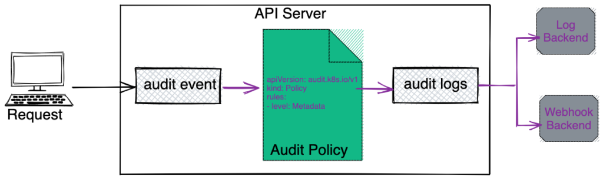
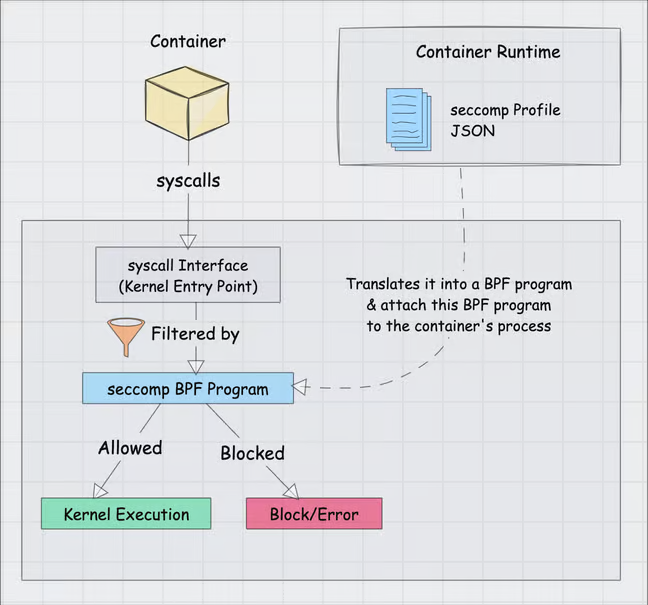

# Certified Kubernetes Security Specialist (CKS)


---

## Cluster setup

---

## CIS Benchmarks & K8s Hardening

- **Standardization**: Industry-wide best practices for secure K8s configuration.
- **Scope**: Covers API Server, ETCD, Kubelet, and Controller Manager.
- **Scoring**: Provides a clear "Pass/Fail" security posture.
- **CKS Focus**: Understanding which flags (e.g., `--anonymous-auth=false`) satisfy the benchmark.


---

## Kube-bench & Automation

- **Tooling**: Aqua Security's open-source tool to run CIS checks.
- **Remediation**: Output includes specific commands to fix vulnerabilities.
- **Continuous Compliance**: Monitoring drift in node security settings.


---

## LAB: Cluster Setup & Hardening

- **Exercise 1**: [Running Kube-bench as a Job](https://k8s-school.fr/labs/en/1_labs/kubebench-10-jobs/index.html   )
- **Exercise 2**: [Manual Remediation of Control Plane](https://k8s-school.fr/labs/en/1_labs/kubebench-20-remediations/index.html)
- **Exercise 3**: [Automation and Continuous Compliance](https://k8s-school.fr/labs/en/1_labs/kubebench-30-automation/index.html)

---

## Auditing, Monitoring, Logging

---

## API Server Audit Logging

- **Configuration**: Set via `--audit-policy-file` and `--audit-log-path` in `api-server` Pod.
- **⚠️ Exam Tip**: You MUST know how to mount the policy file and log directory using `hostPath` volumes and `volumeMounts` within the API Server static pod manifest.

---

## API Server Audit Workflow



---

### Simple Audit Policy Example

```yaml
apiVersion: audit.k8s.io/v1
kind: Policy
omitStages:
- "RequestReceived"
rules:
- level: Metadata
  resources:
  - group: ""
    resources: ["secrets"]
- level: RequestResponse
  resources:
  - group: ""
    resources: ["pods"]
  namespaces: ["production"]
```

[Official Documentation Examples](https://kubernetes.io/docs/tasks/debug/debug-cluster/audit/#audit-policy)

---

## Understanding Audit Stages

Each request can be recorded with an associated stage:

- **RequestReceived**: The stage for events generated as soon as the audit handler receives the request, and before it is delegated down the handler chain.
- **ResponseStarted**: Once the response headers are sent, but before the response body is sent. This stage is only generated for long-running requests (e.g. watch).
- **ResponseComplete**: The response body has been completed and no more bytes will be sent.
- **Panic**: Events generated when a panic occurred.

**⚠️ Exam Tip**: If no stages are defined in the policy, ALL stages are logged by default, which can explode the log file size.

*Think of stages as a timeline of a request. For the CKS exam, you will likely use "ResponseComplete" to ensure you capture whether the request was actually authorized and successful.*

---

## Understanding Audit Levels

The defined audit levels are:

- **None**: don't log events that match this rule.
- **Metadata**: log events with metadata (requesting user, timestamp, resource, verb, etc.) but not request or response body.
- **Request**: log events with request metadata and body but not response body. This does not apply for non-resource requests.
- **RequestResponse**: log events with request metadata, request body and response body. This does not apply for non-resource requests.

**⚠️ Exam Tip**: the "RequestResponse" level is very resource-intensive for CPU and Storage. In production, we usually prefer "Metadata" for sensitive resources like Secrets to maintain performance.*

---

## Deep Dive: Kernel & Isolation

- **Container Architecture**: Containers share the host's OS kernel through System Calls (syscalls)
- **Process Isolation**: Containers use namespaces/cgroups, but lack the hardware isolation of VMs.
- **Security Boundary**: Explains the need for syscall filtering (Seccomp).

**⚠️ Kind (Kubernetes in Docker)**: Syscalls from a "kind" node impact the physical host kernel directly.


---

## Falco: Runtime Security

- **Detection Engine**: Real-time alerting based on kernel system calls.
- **Rule Syntax**: Simple YAML format (Conditions, Outputs, Priorities).
- **Use Cases**: Detecting shell execution in pods, unauthorized file access, or outbound network changes.
- **Output**: Logs to stdout, file, gRPC, or Slack/Webhooks.

*Falco is the "security monitor" of your cluster. It detects threats in real-time but does not block anything (unlike an Admission Controller)*

*For the CKS exam, focus on learning how to modify local rule.*

---

## Falco: Runtime Security


---

## Falco: Rule Configuration Example

To pass the CKS, most tasks involve modifying local rule files (usually `/etc/falco/falco_rules.local.yaml`) to trigger alerts or filter false positives.

### Structure of a Simple Rule

Below is a standard rule designed to detect when a shell is spawned inside a container:

```yaml
- rule: Shell spawned in container
  desc: A shell was used inside a container
  condition: container.id != host and proc.name = bash
  output: "bash in container (user=%user.name container_id=%container.id)"
  priority: WARNING
```

---

## Key Components for the Exam

- **Condition**: The logic used to trigger the alert. Uses field names like `fd.name` (files), `proc.name` (processes), and `container.id`.
- **Output**: The message sent to your logs. Use `%` to inject dynamic data from the event.
- **Macros & Lists**: In a real environment, you often use macros (e.g., `spawned_process`) to keep conditions readable.

### Official Resources

- **Documentation**: [Falco Rules Reference](https://falco.org/docs/rules/)
- **Default Rule Examples**: [Falco GitHub Ruleset](https://github.com/falcosecurity/rules/blob/main/res/falco_rules.yaml)

> **CKS Tip**: If the exam asks you to "silence" an alert for a specific tool, look for the corresponding **Macro** in the configuration and add your exception there rather than deleting the whole rule.

---

## LAB: Audit & Monitoring

- **Exercise 1**: [Configuring Audit Policies](https://k8s-school.fr/labs/en/1_labs/audit-logs/index.html)
- **Exercise 2**: [Falco Runtime Alerts](https://k8s-school.fr/labs/en/1_labs/falco/index.html)

---

## System Hardening

---

## Seccomp (Secure Computing)

- **Syscall Filtering**: Limits what operations a process can request from the kernel, preventing potentially dangerous or unauthorized kernel operations.
- **Default Profiles**: `RuntimeDefault` (provided by Docker/Containerd). It blocks dangerous syscalls while allowing common operations.
- **Custom Profiles**: JSON-based filters for fine-grained syscall control, must stored on **all** Nodes in `/var/lib/kubelet/seccomp/`.

*Seccomp reduces the kernel's "attack surface." If a zero-day vulnerability exists in a rarely-used syscall, Seccomp can protect the cluster by simply blocking that syscall.*

---

## Seccomp Workflow



---

## Seccomp: Pod Application


- Use `securityContext.seccompProfile` to enforce profiles.

**Example Pod with Seccomp**:

```yaml
apiVersion: v1
kind: Pod
metadata:
    name: secure-pod
spec:
    securityContext:
        seccompProfile:
            type: RuntimeDefault
    containers:
    - name: app
        image: nginx:latest
```

---

## Seccomp profiles

- **Unconfined**: The workload runs without any seccomp restrictions.
- **RuntimeDefault**: The default Seccomp profile provided by the container runtime (Docker/Containerd).
- **Localhost**: The availability of the seccomp profile on the Node is verified by the container runtime on container creation.

[Official documentation](https://kubernetes.io/docs/reference/node/seccomp/#seccomp-fields)

---

## AppArmor & SELinux

- **MAC (Mandatory Access Control)**: Enforces security policies regardless of user privileges, adding an extra layer beyond traditional DAC (Discretionary Access Control).
- **AppArmor**: Path-based security using profiles applied to programs (e.g., `deny /etc/shadow write`).
- **SELinux**: Label-based security using contexts and policies for fine-grained access control.
- **Profile Management**: Profiles must be loaded on **all** nodes using `apparmor_parser` before Pod scheduling.
- **K8s Integration**: Enforced via Pod annotations (`container.apparmor.security.beta.kubernetes.io/<container_name>`) only. SecurityContext support is not yet available.

**⚠️ CKS Focus**: The exam primarily focuses on AppArmor. Key point: profiles must exist on ALL nodes where the Pod might be scheduled.

---

## AppArmor: Pod Example

### Securing a Pod with AppArmor

```yaml
apiVersion: v1
kind: Pod
metadata:
  name: hello-apparmor
  annotations:
    # Tell Kubernetes to apply the AppArmor profile "k8s-apparmor-example-deny-write".
    # Note that this is ignored if the Kubernetes node is not running AppArmor.
    container.apparmor.security.beta.kubernetes.io/hello: localhost/k8s-apparmor-example-deny-write
spec:
  containers:
  - name: hello
    image: busybox:1.28
    command: [ "sh", "-c", "echo 'Hello AppArmor!' && sleep 1h" ]
```

**Reference**: [Kubernetes AppArmor Tutorial - Securing a Pod](https://kubernetes.io/docs/tutorials/security/apparmor/#securing-a-pod)

**⚠️ Key Points**:
- Profile `k8s-apparmor-example-deny-write` must exist on all nodes
- Annotation format: `container.apparmor.security.beta.kubernetes.io/<container-name>: localhost/<profile-name>`

---

## LAB: AppArmor Implementation

- **Exercise**: [AppArmor Security Profiles](https://k8s-school.fr/labs/en/1_labs/apparmor/index.html)
- **Official Tutorial**: [Kubernetes AppArmor Documentation](https://kubernetes.io/docs/tutorials/security/apparmor/)

*This lab will be skipped because it is very similar to the secomp one*

**Key Learning Points:**

- Creating and loading AppArmor profiles on nodes
- Applying profiles to Kubernetes pods using annotations
- Testing profile enforcement and debugging violations

---

## LAB 3: Kernel-Level Security

- **Exercise 1**: [Custom Seccomp Profiles](https://github.com/votre-repo/lab-seccomp)
- **Exercise 2**: [Enforcing AppArmor Profiles](https://github.com/votre-repo/lab-apparmor)

---

## Trivy: Vulnerability Scanning

- **Scanning Capability**: Images, Filesystems, Git repos, and K8s clusters.
- **SBOM Generation**: Creating a Software Bill of Materials (CycloneDX).
- **Severity Levels**: Filter results by `CRITICAL`, `HIGH`, etc.
- **CLI Usage**: `trivy image <image_name>` is your best friend during the exam.

**Speaker Notes**: Trivy est l'outil de scan d'images par excellence. Insistez sur l'importance du SBOM pour la conformité de la chaîne logicielle (savoir exactement ce qui compose votre image).

---

## ImagePolicyWebhook

- **Admission Control**: External validation before a Pod is created.
- **Mechanism**: API Server sends a JSON payload to an external endpoint.
- **Policy**: Allowed or Denied based on image tags, provenance, or scan results.
- **Configuration**: Requires a `KubeConfig` file for the webhook and an Admission Configuration file.

**Speaker Notes**: C'est le niveau ultime de la Supply Chain Security. On ne fait plus confiance au manifest, on demande à un tiers de confiance (le Webhook) de valider si l'image est autorisée.

---

## LAB 4: Supply Chain Security

- **Exercise 1**: [Scanning with Trivy](https://github.com/votre-repo/lab-trivy)
- **Exercise 2**: [Setting up ImagePolicyWebhook](https://github.com/votre-repo/lab-webhook)
